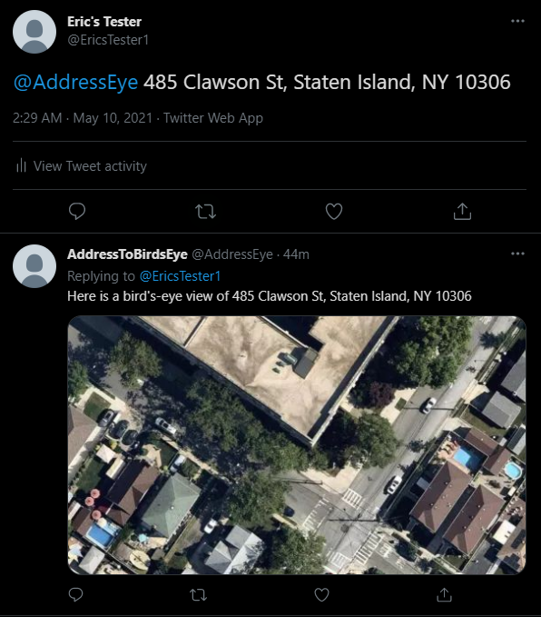

# AddressEye

AddressEye is a [Twitter bot](https://twitter.com/AddressEye) that can convert a property address into a satellite image representing a birds-eye view. Internally, it uses the [MapQuest Geocoding API](https://developer.mapquest.com/documentation/geocoding-api/) to convert addresses into latitude and longitude coordinate pairs. Then, it passes these pairs through the [MapBox Satellite Imagery API](https://docs.mapbox.com/help/getting-started/satellite-imagery/) to obtain satellite imagery.

## Try it out

To try out [AddressEye](https://twitter.com/AddressEye), send a tweet to @AddressEye with an address. For example: `@AddressEye 1815 Stadium Rd, Charlottesville, VA 22903`. For usage instructions, send `@AddressEye help`.

## Sample output



## Building With Docker

To build a Docker image of AddressEye, run `docker build -t address_eye .` after cloning this repository and `cd`ing into the directory.
Alternatively, you could pull the [docker image from dockerhub](https://hub.docker.com/r/ericthestein/address_eye) by running `docker pull ericthestein/address_eye`

## Running With Docker

To run the previously-built Docker image, run the following, adding in your keys as necessary:
```
docker run -d -p 8080:80 \
  -e TWITTER_CONSUMER_KEY= \
  -e TWITTER_CONSUMER_SECRET= \
  -e TWITTER_ACCESS_TOKEN= \
  -e TWITTER_ACCESS_TOKEN_SECRET= \
  -e TWITTER_ENV_NAME= \
  -e WEBHOOK_ENDPOINT= \
  -e TWITTER_HANDLE= \
  -e MAPQUEST_KEY= \
  -e MAPBOX_KEY= \
  -e RUN_MODE= \
ericthestein/address_eye
```

The `RUN_MODE`s available are:
1) API: Runs AddressEye as a REST API. This contains numerous methods, including one that directly returns a satellite image from an address passed in through JSON, one that processes mentions sent via Twitter's Account Activity API webhook, and one that properly replies to Twitter's Challenge Response Check (CRC). @AddressEye's API is running on LightSail at https://address-eye.0mg5o04lbriga.us-east-1.cs.amazonlightsail.com/. If you choose this `RUN_MODE`, you can test the /address GET endpoint using Postman by sending the following raw body as JSON to `localhost:8080/address/`:
```
{
    "address": "YOUR ADDRESS HERE"
}
```

3) REGISTER: Registers for and subscribes to Twitter's Account Activity API webhook.
4) INTERVAL: At a set interval, collects and processes all mentions of @AddressEye.

Depending on the `RUN_MODE` you choose, you may not need all of the keys specified.

## Built With

AddressEye was developed using:
1) [Twitter Account Activity API](https://developer.twitter.com/en/docs/twitter-api/enterprise/account-activity-api/overview)
2) [MapQuest Geocoding API](https://developer.mapquest.com/documentation/geocoding-api/)
3) [MapBox Satellite Imagery API](https://docs.mapbox.com/help/getting-started/satellite-imagery/)
4) [Amazon Lightsail](https://lightsail.aws.amazon.com/)
5) [FastAPI](https://fastapi.tiangolo.com/)
6) [Docker](https://www.docker.com/)
7) [Python](https://www.python.org/)
